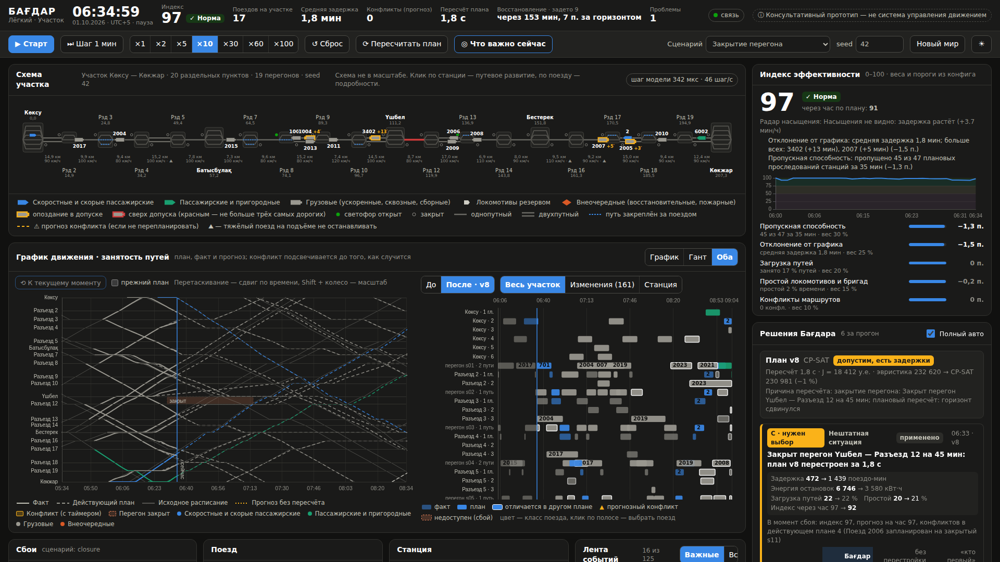

# Бағдар — автодиспетчер железнодорожного участка

> «Бағдар» по-казахски значит «курс, ориентир». Прототип для хакатона «ИИ на железной
> дороге», кейс «Автодиспетчер».

**Консультативный прототип — не система управления движением.** Не управляет реальными
сигналами, стрелками и поездами и не заменяет устройства СЦБ. Все данные синтетические,
веса, цены и «сэкономленные деньги» условные.

Предметная область и правила — [`docs/BAGDAR.md`](docs/BAGDAR.md), план сайта и
сценариев — [`docs/BAGDAR_PLAN.md`](docs/BAGDAR_PLAN.md), контракт API —
[`docs/CONTRACT.md`](docs/CONTRACT.md), планировщик — [`docs/PLANNER.md`](docs/PLANNER.md),
индекс — [`docs/INDEX.md`](docs/INDEX.md), сбои и сценарии — [`docs/INCIDENTS.md`](docs/INCIDENTS.md).

## Состояние по этапам

| Этап | Что | Статус |
|---|---|---|
| 1 | Генератор участка и графика по seed, симулятор, API, поток, схема с едущими поездами | готов |
| 2 | Планировщик: CP-SAT + эвристика, независимый валидатор, карточки решений, пересчёт по событиям | готов |
| 3 | Экран диспетчера: график движения, Гант «до/после», индекс, панель решений с отменой B и выбором C | готов |
| 4 | Сбои и перепланирование «до / после», обязательные сценарии и первая волна («Замок», «Эффект бабочки», «Тихое насыщение») | готов |
| 5–11 | Советчик скорости, журнал и перемотка, «Человек против Бағдара», средний и ультра-режим, Docker | не начаты |



## Быстрый старт

Одной командой, нужен только Docker:

```bash
docker compose up --build        # http://localhost:8000, Swagger — /docs, витрина — /showcase/index.html
```

Без Docker:

Нужны Python 3.11+ и Node.js 20.19+ (проверено на Python 3.11 и Node 22).

```bash
# backend
cd backend
pip install -r requirements-dev.txt
python3 -m uvicorn bagdar.api.app:app --port 8000      # http://localhost:8000/docs

# frontend (в другом терминале)
cd frontend
npm install
npm run dev                                           # http://localhost:5173
```

Или одной командой из корня: `./scripts/dev.sh`.

**Windows.** Вместо `python3` пишите `python`. Одной командой из PowerShell:
`powershell -ExecutionPolicy Bypass -File scripts\dev.ps1` — скрипт возьмёт Python из
`backend\.venv`, если окружение создано, и сам поставит зависимости фронтенда.
Если в логах ошибки кодировки, задайте `PYTHONUTF8=1`.

Витрина (презентация, ситуации, записи прогонов) — раздел того же сайта: `/showcase/index.html`, исходники в `showcase/`, подробности в `showcase/README.md`.

Один порт без Vite: `cd frontend && npm run build`, затем запустить backend —
он раздаёт собранный фронтенд на `http://localhost:8000/`.

Тесты: `cd backend && python3 -m pytest` (68 тестов, ~12 мин — планировщик решает по-настоящему,
сценарии прогоняются часами модели).
Замер пересчёта: `cd backend && python3 scripts/bench_planner.py` → [`docs/BENCHMARK.md`](docs/BENCHMARK.md).
Проверка типов фронтенда: `cd frontend && npm run typecheck`.

## Что можно сделать сейчас

- **Экран диспетчера.** Сверху индекс со статусом, задержка, прогноз конфликтов, время
  пересчёта, прогноз восстановления графика. В центре схема участка. Под ней график движения
  и диаграмма Ганта (по отдельности или вместе). Внизу поезд, станция и лента. Справа индекс
  с факторами и решения Бағдара. На экране не больше трёх красных элементов, остальное — в
  счётчике «Проблемы».
- **График движения**: время по горизонтали, станции по вертикали. Серая нитка — исходное
  расписание, пунктир — действующий план, сплошная — факт, точки — прогноз без пересчёта.
  Будущий конфликт виден как пересечение ниток и подсвечен с таймером «⚠ 22 мин». Наведение на
  нитку — подсказка, клик — выбрать поезд. Можно сдвигать окно времени и показать прежний план.
- **Гант** занятости путей и перегонов: слева от «сейчас» факт, справа план. Переключатель
  «До / После» показывает предыдущий или действующий план, изменённые интервалы обведены.
  Фильтры: весь участок, только изменения, выбранная станция.
- **Индекс 0–100**: вклад пяти факторов, причины ухудшения, динамика с полосами порогов,
  прогноз по плану на час. Нет данных — фактор помечен, веса перенормированы.
- **Решения**: задержите поезд (+5/+10/+15 мин в его карточке) — Бағдар перестроит план за
  ~1,8 с и покажет карточки с влиянием на задержку, энергию, загрузку путей и индекс. У решения
  B есть кнопка «Отменить» с таймером 30 с, у решения C — 2–3 варианта с ценой. Решение
  диспетчера закрепляется: следующий пересчёт его не переворачивает.
- **Сбои** (панель «Сбой» внизу): опоздание поезда, закрытие перегона (в том числе «срок
  неизвестен»), неисправный светофор (движение как при ПАБ, 40 км/ч), путь или стрелка
  недоступны, ограничение скорости, рост потока, внеочередной поезд. Выключить путь можно и из
  карточки станции. После события Бағдар пересчитывает план и показывает карточку
  «Нештатная ситуация»: что задето, когда восстановится график, и таблицу «до / после» —
  Бағдар, «ничего не менять в порядке», «кто первый пришёл». У опоздания — дерево
  распространения задержки (кто кого задержал, где и на сколько). Действующие сбои — с таймером
  и кнопкой «Снять», на графике движения закрытый перегон заштрихован, на Ганте выключенный
  ресурс обведён пунктиром.
- **Сценарии** — файлы в `backend/scenarios/`: опоздание скорого, отказы светофора и стрелки,
  закрытие перегона, рост потока, «Замок», «Эффект бабочки», «Тихое насыщение». События идут по
  модельному времени, ближайшее показано на панели сбоев.
- **Радар насыщения** в панели индекса: по тренду последнего часа — через сколько участок
  перестанет справляться; «Варианты придержания» считают, сколько грузовых придержать на
  станциях отправления, «Применить» — придерживает.
- **«Полный авто»** в панели решений: выключите — и решения C будут ждать вашего выбора, а
  прогнозные конфликты останутся на экране.
- **«Что важно сейчас»** (клавиша F) из любого состояния: решение, которое ждёт выбора,
  самая дорогая тревога, ближайший конфликт.
- Старт и пауза (пробел), шаг на 1 минуту модели (→), ускорение ×1…×100, сброс, любой seed.
- Клик по поезду — состояние, состав, бригада, расписание, подсветка на схеме, графике и Ганте.
  Клик по станции — путевое развитие, горловины, ближайшие поезда.
- Тёмная и светлая темы.

## Архитектура

```text
backend/bagdar/
  config.py            YAML-конфиг весов и порогов (pydantic)
  core/                классы поездов по ПТЭ, кинематика, правила занятия ресурсов
  models/              инфраструктура, поезд, план
  generator/           участок по seed → поток поездов → бесконфликтный график (план v0)
  validator/           независимая проверка плана (слой 0)
  planner/             снимок → эвристика + CP-SAT → проверка → карточки; очередь пересчётов,
                       уровни автономии, прогноз конфликтов и восстановления, занятость для Ганта,
                       дерево задержки, варианты придержания при насыщении
  index/               индекс эффективности: пять факторов, история, прогноз по плану
  sim/                 движок с фиксированным шагом, Interlocking (аналог СЦБ), исполнитель плана
  incidents.py         сбои: применение к модели, таймеры, события сценария, отчёт «до / после»
  runtime.py           цикл симуляции, управление, рассылка подписчикам
  dto.py               внутреннее состояние → контракт API
  api/                 FastAPI: REST, WebSocket, схемы
backend/config/default.yaml   конфиг
backend/scenarios/*.yaml      сценарии как данные
frontend/src/
  api/                 типы из OpenAPI, REST-клиент, WebSocket с переподключением
  store/               состояние клиента (zustand)
  components/          верхняя панель, управление, SVG-схема, поезд, станция, лента, решения,
                       панель сбоев, отчёт «до / после»
  charts/              ECharts: график движения, Гант «до/после», индекс и его динамика
```

Поток данных: генератор строит мир и исходный график → валидатор проверяет график
(при нарушении сервер не стартует сценарий) → планировщик строит оперативный план
(эвристика + CP-SAT, проверка валидатором) → движок исполняет план шаг за шагом →
прогноз конфликтов и события запускают пересчёт → runtime раз в 100 мс отправляет
снимок состояния, события и карточки — сразу → браузер интерполирует движение.

Планировщик, целевая функция, ограничения и слои приоритетов — [`docs/PLANNER.md`](docs/PLANNER.md).

## Модель и допущения

- **Участок**: 20 раздельных пунктов (2 участковые станции, 3 промежуточные, 15 разъездов),
  19 перегонов: 12 однопутных и 7 двухпутных вставок (подходы к крупным станциям и
  длинные перегоны). Пути станций разной длины: на коротком разъезде длинный грузовой
  стоять не может. У станции две горловины, каждая пропускает один маршрут за раз.
- **Поток**: ~95 поездов в сутки (seed 42: 12 пассажирских, 6 пригородных, 70 грузовых, 6 локомотивов резервом);
  в окне 06:00–12:00 одновременно 15–21 поезд. Грузовые идут пакетами.
- **Исходный график** строится вставкой поездов по очереди (класс ПТЭ, затем время)
  в таблицу резервирования перегонов, путей и горловин и проверяется независимым валидатором.
- **Безопасность в симуляторе** (Interlocking): встречные на однопутном перегоне исключены,
  попутные — с интервалом и по блок-участкам, ПАБ — один поезд на перегоне, путь — только
  свободный и подходящей длины, горловина — один маршрут. Перед впуском на однопутный
  перегон закрепляется путь приёма на следующей станции, чтобы поезд не застрял на перегоне.
  От «замка» двух станций СЦБ не защищает — это работа плана (см. [`docs/INCIDENTS.md`](docs/INCIDENTS.md)).
- **Исполнение плана**: поезда входят на перегоны в порядке плана и не раньше планового
  времени, а на станционный путь — после тех, кого план принимает на него раньше; машинист
  ведёт поезд так, чтобы прибыть по плану, не выше лимита скорости.
- **Случайность**: затянутые стоянки и позднее отправление со станции формирования
  берутся из генератора с seed — прогон повторяем.
- Кинематика упрощённая: постоянные ускорение и торможение, уклон снижает ускорение и
  скорость тяжёлых поездов. Это не тяговый расчёт.

## Известные ограничения

- На перегруженном однопутном участке («Рост потока») эвристики иногда бросают часть поездов
  во втором-третьем часу горизонта, и CP-SAT наследует их набор плеч. В отчёте это видно как
  «застряло в плане» и штрафуется. До движения тупик не доходит: план пересчитывается каждые
  5 мин модели, и в симуляции поезда не встают.
- Закрытие двухпутной вставки закрывает перегон целиком. Для сбоя без срока план строится с
  перегоном, закрытым до конца горизонта; вариантов «а если откроют раньше» пока нет.
- Оценка вариантов придержания при насыщении приближённая: событийный планировщик на
  перегруженной модели сам иногда запирается.
- Индекс считается для одного участка. Индекс по зонам и сети появится вместе со средним
  режимом (этап 8). Веса и пороги меняются в YAML, меню настроек — этап 5.
- Окно графика и Ганта — от получаса назад до 2,5 часа вперёд. Перемотка в прошлое — этап 6.
- Решение C в «полном авто» применяется сразу, а не по таймауту: поезда идут, ждать
  нельзя. Другой вариант можно выбрать, пока идёт таймер.
- CP-SAT живёт под лимитом 2 с. В сложных ситуациях он может не дойти до оптимума,
  и тогда публикуется лучший из проверенных кандидатов (иногда эвристика). Набор плеч CP-SAT
  ограничен планом-подсказкой — подробнее в [`docs/PLANNER.md`](docs/PLANNER.md).
- Карточка решения не показывает цену альтернативы, если быстрая модель оценки не воспроизводит
  опубликованный план для этой пары: цифры были бы артефактом, так прямо и написано.
  В живом режиме результат не побитово повторяем, в синхронном детерминирован.
- Состояние живёт в памяти: после перезапуска сервера сценарий начинается заново
  (журнал в SQLite и перемотка — этап 6). Docker Compose — этап 10.
