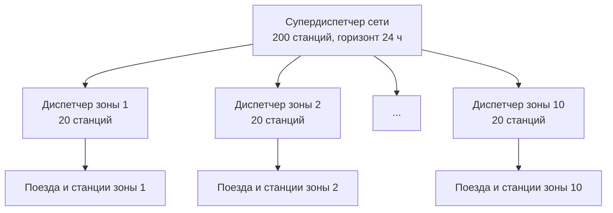
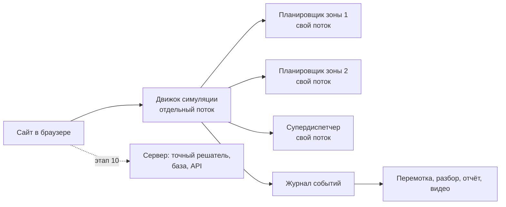

# БАҒДАР — план сайта и моделирования

> Документ для переноса в рабочий чат. Читается вместе с `BAGDAR.md` (там правила приоритетов, экономика, индекс, модель данных).
> Здесь: что строим, в каком порядке, какие ситуации моделируем и как их показываем.
> Версия 0.2 от 01.10.2026.

---

## 0. Как использовать в новом чате

Загрузи оба файла и напиши первое сообщение:

```text
Мы строим сайт-симулятор «Бағдар» — автодиспетчер железной дороги.
BAGDAR.md — правила и модель. BAGDAR_PLAN.md — план работ.
Начни с этапа 1 из раздела 9 плана. После каждого этапа показывай
рабочий результат и жди моего «дальше».
Главный приоритет: сайт и визуализация сложных ситуаций.
```

Правило для рабочего чата: каждый этап заканчивается тем, что можно открыть и потрогать. Никаких этапов «подготовили архитектуру, смотреть пока нечего».

---

## 1. Суть в одном абзаце

Сайт, на котором железная дорога живёт в реальном времени: поезда едут, что-то ломается, и система на глазах у зрителя разруливает ситуацию, с которой человек не справился бы. Три уровня сложности, от одного участка до целой сети. Главный номер программы: один и тот же сценарий проигрывается дважды, с человеческой логикой и с Бағдаром, и разница видна в цифрах.

### Почему человек не справляется (цифры для первого экрана)

Диспетчер должен держать в голове пары поездов, которые могут помешать друг другу.

| Поездов | Пар, которые надо проверить |
|---|---|
| 20 | 190 |
| 100 | 4 950 |
| 1 000 | 499 500 |

Человек уверенно следит за 5–9 объектами одновременно. При 20 поездах он уже работает на пределе, при 100 выбирает, что игнорировать. При этом каждая проверка повторяется каждую минуту, а цена ошибки растёт цепочкой.

---

## 2. Три режима моделирования

| Режим | Станций | Поездов одновременно | Диспетчеров | Сбоев одновременно | Для чего |
|---|---|---|---|---|---|
| **Лёгкий «Участок»** | 20 | около 20 | 1 | 1 | Понять логику, показать скрещения и обгоны. Ядро для защиты |
| **Средний «Регион»** | 60–100 | 100–150 | 3–5 и 1 координатор | 2–3 | Основной режим демонстрации, «средний результат» |
| **Ультра «Сеть»** | 200, из них 50 в кризисе | до 1 000 | 10 и 1 супердиспетчер | 10 и больше, цепные | Показать то, что человеку недоступно в принципе |

Честная оговорка про ультра. 20 поездов одновременно на каждой станции физически не поместятся: на обычной станции 3–8 путей, столько вмещают только крупные узлы. Поэтому ультра задан так: 200 станций, около 1 000 поездов в сети, и 50 станций одновременно в беде. Нагрузка получается в несколько раз выше реальной, и это нужно говорить прямо: «стресс-тест за пределами возможного в жизни». Звучит сильнее, чем попытка выдать это за реализм.

Масштаб дальше растёт тем же принципом: 2 000 станций, 100 диспетчеров, 10 координаторов, 1 сетевой. Отдельно это не строим, достаточно показать, что схема повторяется.

---

## 3. Иерархия диспетчеров



| Уровень | Кто | Что решает | Горизонт | Как часто пересчитывает |
|---|---|---|---|---|
| L0 | Советчик машинисту | Скорость, выбег, подход к станции без остановки | 10–30 мин | Каждые несколько секунд |
| L1 | Диспетчер зоны (20 станций) | Порядок поездов, пути приёма, скрещения, обгоны | 2–3 ч | При каждом событии |
| L2 | Супердиспетчер (10 зон) | Передача поездов между зонами, объезды, делёж резервов | 6–12 ч | Раз в 1–5 мин |
| L3 | Сетевой уровень (10 супердиспетчеров) | Какие потоки по каким коридорам, сколько впускать в сеть | 24–48 ч | Раз в 15 мин |

### Главный принцип: вверх идут сводки, вниз идут рамки

- **Вверх** зона сообщает не каждый поезд, а сводку: индекс, свободная ёмкость на каждой границе, длина очередей, прогноз на час.
- **Вниз** приходит не «поезду 2104 стоять», а рамка: «через границу с зоной 4 принимаю не больше 3 поездов за 20 минут», «окно 14:10–14:25 для пожарного поезда».
- Внутри рамки зона решает сама.

Без этого верхний уровень утонул бы в данных точно так же, как человек.

### Договор на границе (слот)

Поезд переходит из зоны в зону только по согласованному слоту: время, путь, скорость. Если зона А хочет отдать поезд раньше, она «спрашивает цену» у зоны Б. Супердиспетчер выбирает вариант, где суммарный ущерб двух зон минимален. Это лечит болезнь, когда каждый диспетчер хорош у себя, а на стыке пробка.

### Когда проблема уходит наверх

1. Она задевает границу зоны.
2. Зона не может решить её дешевле заданного порога.
3. Нужен ресурс, которого в зоне нет: локомотив, бригада, объездной маршрут.
4. Зона перестала отвечать.

---

## 4. Библиотека ситуаций

Формат каждой: что происходит, почему человек не справится, что делает Бағдар, что видит зритель.

### А. Физика и инфраструктура

**1. Замок.** *(лёгкий режим)*
Однопутный участок. Четыре длинных поезда входят навстречу друг другу, и через 35 минут все разъезды заняты так, что никто не может двинуться, не сдав назад.
*Человек:* каждое решение по отдельности выглядело правильным. Ловушку видно только когда она захлопнулась.
*Бағдар:* перед тем как впустить поезд на перегон, проверяет, что впереди для него останется свободный путь нужной длины. Видит замок за 40 минут и придерживает один поезд на 6 минут двумя станциями раньше.
*Экран:* «радар затора» рисует будущую пробку красным пунктиром, потом она исчезает после одного решения.

**2. Второй удар.** *(средний)*
Отключилась тяговая подстанция. 9 электропоездов остались без тяги на трёх перегонах.
*Человек:* не посчитает, кто докатится до станции по инерции, а кто встанет в поле. И не знает главного: когда напряжение вернётся, нельзя трогать все поезда сразу, подстанцию выбьет снова.
*Бағдар:* по скорости, массе и уклону считает, кто дотянет до станции, и даёт им команду на выбег. Для остальных вызывает тепловозы. После включения выстраивает очередь на разгон по приоритету, чтобы суммарная мощность не превысила предел.
*Экран:* перегоны гаснут, у каждого поезда линия «докатится досюда», затем шкала мощности подстанции и поезда, которые стартуют по одному.

**3. Буран идёт по карте.** *(средний)*
Снежный фронт движется через регион со скоростью 40 км/ч. Перегоны перед ним сначала получают ограничение скорости, потом закрываются. Снегоочистители идут как внеочередные.
*Человек:* реагирует на то, что уже закрыто. А задача в том, чтобы к приходу фронта ни один пассажирский поезд не оказался на перегоне в степи.
*Бағдар:* считает, какой поезд где будет в момент прихода фронта. Заранее заводит пассажирские на крупные станции, грузовые расставляет по мелким разъездам, держит коридор для снегоочистителей.
*Экран:* фронт ползёт по карте полосой, поезда «прячутся» на станции до его прихода.

**4. Огонь и ветер.** *(средний)*
На станции горит цистерна. Зона опасности зависит от ветра и захватывает соседний перегон. Рядом стоят ещё два состава с опасным грузом, через 11 минут подходит пассажирский. Пожарному поезду ехать навстречу потоку.
*Человек:* пять задач разного типа в одну минуту.
*Бағдар:* строит зону запрета по ветру, останавливает пассажирский за две станции, уводит опасные составы, расчищает путь пожарному поезду и пускает остальных в объезд.
*Экран:* пятно зоны поворачивается при смене ветра, пожарному поезду открывается «зелёная улица».

**5. Не отправляй в пробку.** *(ультра)*
Мост закрыт на 14 часов. 60 поездов надо пустить в объезд, а объезд однопутный и тянет треть потока.
*Человек:* продолжает отправлять поезда, потому что «у меня на станции свободно». Они встают на подходах и запирают всё вокруг.
*Бағдар (L3):* считает, сколько объезд пропустит в час, раздаёт слоты, остальные поезда держит на станциях отправления, где есть место. Малоценные грузовые объединяет или откладывает.
*Экран:* потоки на карте сети как реки: толщина линии равна числу поездов, объезд не переполняется.

### Б. Люди и ресурсы

**6. Вторая авария через четыре часа.** *(средний)*
Сбой длился три часа и вроде закончился. Но за это время у 15 бригад почти вышло рабочее время. Поезда без бригад встают на станциях, занимают пути, и сеть падает второй раз, когда все уже выдохнули.
*Человек:* бригадные часы в голове не держит вообще.
*Бағдар:* у каждого поезда есть таймер «через сколько он превратится в препятствие». Такие поезда получают повышенный вес и успевают дойти до станции смены бригад.
*Экран:* над поездами тикают таймеры, жёлтые становятся красными.

**7. Диспетчер тонет.** *(средний)*
Событий больше, чем человек успевает подтверждать: очередь решений растёт, время реакции растёт, он начинает отменять собственные команды.
*Бағдар:* следит не только за поездами, но и за нагрузкой на человека. При перегрузе сам поднимает себе уровень автономии для недорогих решений, а на экране оставляет один вопрос за раз, самый дорогой.
*Экран:* шкала нагрузки диспетчера, переключение интерфейса в «режим одного вопроса».

**8. Центр пропал.** *(ультра)*
Диспетчерский центр зоны 6 потерял связь. 20 станций без управления.
*Бағдар (L2):* поезда зоны переводятся в безопасный режим: дойти до ближайшей станции и стоять. Затем зона делится пополам и передаётся соседям, пятой и седьмой. Их горизонт планирования сужается, чтобы они выдержали нагрузку.
*Экран:* зона на карте сереет, потом окрашивается в цвета соседей.

**9. Эвакуация города.** *(ультра)*
Нужно вывезти людей из города за ограниченное время.
*Бағдар:* целевая функция меняется целиком: больше не «минимум задержек», а «максимум людей в час». Все грузовые уходят на боковые пути. Оба пути двухпутной линии работают в одну сторону, пустые составы возвращаются по другому маршруту кольцом.
*Экран:* счётчик вывезенных людей, все стрелки на карте разворачиваются в одну сторону.

### В. Цифры и данные

**10. Шквал тревог.** *(средний)*
За минуту приходит 300 сигналов: занятость, опоздания, отказы, предупреждения.
*Человек:* это и есть момент паники. Он читает первые десять и теряет картину.
*Бағдар:* связывает тревоги по месту и времени и находит корень. 300 сигналов сворачиваются в три карточки: «отказ питания на станции 14 (вызвал 212 сигналов)», «опоздание поезда 38 (61 сигнал)», «не связано ни с чем (27)».
*Экран:* стена красных строк схлопывается в три карточки. Один из самых сильных моментов для видео.

**11. Туман.** *(средний)*
Пропала связь с 12 поездами. Где они сейчас, неизвестно.
*Бағдар:* для каждого поезда рисует отрезок, где он может быть: от «встал сразу» до «ехал на максимальной». Отрезок растёт со временем. План строится так, будто поезд занимает весь отрезок. Первыми запрашиваются те поезда, чья неопределённость блокирует больше всего путей.
*Экран:* поезд превращается в растущую полупрозрачную полосу, потом «проявляется» в точке.

**12. Поезд-призрак и поезд-телепорт.** *(средний)*
Данные врут. Перегон показывает занятость, хотя поезда там нет. Один поезд по данным за минуту проехал 90 км. Два источника называют разное положение одного состава. На одной станции часы отстают на 4 минуты.
*Человек:* верит экрану.
*Бағдар:* проверяет каждое сообщение на физическую возможность: скорость, непрерывность пути, один поезд в одном месте. Невозможное уходит в карантин с пометкой «не верю, потому что». У источников есть оценка доверия.
*Экран:* подозрительные данные мигают штриховкой, рядом причина.

### Г. Системные: никто не виноват

**13. Тихое насыщение.** *(средний)*
Ничего не сломалось. Просто поездов на 5 % больше, чем участок способен пропустить. Очереди растут по минуте в час.
*Человек:* не замечает, пока не встанет всё.
*Бағдар:* считает прогноз загрузки и говорит заранее: «через 3 ч 40 мин участок остановится». Решение скучное и дешёвое: придержать четыре грузовых на станции отправления.
*Экран:* график загрузки с красной точкой в будущем, после решения точка исчезает.

**14. Война соседей.** *(средний, ультра)*
Диспетчер А разгружает свою зону и гонит шесть поездов к границе. Диспетчер Б принять их не может. У обоих индекс в норме, на стыке пробка.
*Бағдар (L2):* слоты и «цена приёма» из раздела 3.
*Экран:* два зелёных индекса зон и красная граница между ними.

**15. Эффект бабочки.** *(лёгкий)*
Один поезд опоздал на 4 минуты. Через три часа задеты 38 поездов.
*Бағдар:* строит дерево распространения задержки и ищет, где цепочку дешевле всего перерубить. Обычно это один малоценный поезд, который подождёт 9 минут и спасёт остальные.
*Экран:* дерево задержек разрастается, затем обрезается в одном узле.

**16. Два внеочередных навстречу.** *(средний)*
Пожарный и восстановительный поезда едут к разным авариям по одному перегону навстречу друг другу. Правило «внеочередной всегда первый» перестаёт работать.
*Бағдар:* сравнивает цену минуты ожидания на каждой аварии и решает, кто уступит.

**17. Идеальный шторм.** *(ультра, финал)*
Буран, отключение подстанции, истекающие бригады и потеря данных в одной зоне. Всё сразу.
*Бағдар:* сортирует проблемы как врач при массовом поступлении раненых: по цене минуты бездействия. На экране всегда три главных проблемы, остальное в счётчике.

---

## 5. То, чего в таких прототипах обычно нет

1. **Человек против Бағдара.** Сценарий идёт на разделённом экране: слева простая логика «кто первый пришёл, тот первый едет», справа Бағдар. Счётчики минут задержки, энергии, условных денег. Режим-игра: зритель сам пробует быть диспетчером и проигрывает.
2. **Машина времени.** В любой момент мир копируется и три варианта решения прокручиваются вперёд на ускорении. Зритель видит три будущих и выбирает.
3. **Радар затора.** Проблема показывается до того, как она случилась, с таймером «осталось 22 минуты».
4. **Сжатие тревог.** 300 сигналов в три причины.
5. **Монитор перегрузки диспетчера** с автоматическим ростом автономии.
6. **Карта давления.** Сеть как живой организм: напряжённые участки светятся, задержка расходится волной.
7. **Цена минуты.** Живой счётчик «сэкономлено» в условных единицах. На защите обязательно говорить, что единицы условные.
8. **Генератор хаоса.** Случайные сбои с настройкой сложности и номером-зерном, чтобы любой сценарий можно было повторить один в один. Плюс «режим руки»: ткнул в карту и сломал что угодно.
9. **Чёрный ящик.** После сценария сам собирается разбор: хронология, решения, что было бы без системы.
10. **Решение при неизвестной длительности.** Когда непонятно, на сколько закрыт перегон, считаются три варианта (10, 30, 60 минут) и выбирается план, который не проваливается ни в одном.

---

## 6. Визуализация: диаграммы и видео

### Диаграммы

| Диаграмма | Что показывает | Где нужна |
|---|---|---|
| Карта сети | Станции, перегоны, поезда, зоны диспетчеров | Всегда, главный экран |
| График движения (время по горизонтали, станции по вертикали) | Нитки поездов: план, факт, прогноз. Конфликт виден как пересечение линий | Лёгкий режим, зона в среднем |
| Занятость путей станции (полосы по времени) | Какой путь когда занят | При клике на станцию |
| Индекс 0–100 и его факторы | Состояние участка одним числом | Всегда |
| Карта давления | Напряжённость сети цветом | Средний и ультра |
| Дерево задержек | Кто кого задержал | Сценарии 6, 15 |
| Потоки | Толщина линии равна числу поездов | Ультра, сценарий 5 |
| Лента решений | Карточки: что сделано, почему, альтернатива | Всегда |
| Шкала времени | Перемотка, события метками | Всегда |

### Смысловое приближение (обязательно для ультра)

Тысячу поездов нельзя показать точками, получится шум. Поэтому картинка зависит от масштаба:
- **сеть:** зоны как цветные области с индексом, потоки линиями;
- **регион:** станции и перегоны, поезда пачками с числом;
- **участок:** каждый поезд отдельно, сигналы, пути;
- **поезд:** скорость, совет машинисту, бригада, груз.

### Видео

1. **Запись с экрана внутри сайта.** Кнопка «записать сценарий»: симуляция проигрывается и сохраняется видеофайлом. Основной способ.
2. **Ускоренный ролик графика.** Как нитки перерисовываются при сбое, 3 часа за 20 секунд.
3. **Заставка к сценарию.** Короткий сгенерированный ролик на 5–10 секунд (буран в степи, огонь на станции) с закадровым голосом. Только для атмосферы, делается в последнюю очередь.
4. **Авторазбор с голосом.** Чёрный ящик зачитывает хронологию поверх повтора.

---

## 7. Структура сайта

1. **Главная.** Одна фраза, три цифры из раздела 1, кнопка «Запустить», фоном идёт живая сеть.
2. **Симулятор.** Основной экран: выбор режима, карта, график, индекс, лента решений, панель сбоев, управление временем (пауза, ×1 до ×100, назад).
3. **Сценарии.** Карточки из раздела 4: название, сложность, превью, «запустить».
4. **Человек против Бағдара.** Разделённый экран и режим-игра.
5. **Разбор.** Повтор, хронология, выгрузка отчёта и видео.
6. **Как это работает.** Иерархия, приоритеты, формула индекса. По сути презентация для жюри.
7. **Настройки.** Веса индекса и приоритетов, меняются на лету.

Правила интерфейса: на экране не больше трёх красных элементов одновременно; любое решение системы объяснено одной строкой; из любого состояния одна кнопка возвращает к «что сейчас самое важное».

---

## 8. Как это реализовать

### Два контура



**Контур 1: всё в браузере.** Симуляция и планировщик работают прямо на сайте, сервер не нужен. Сайт открывается по ссылке и не зависит от интернета в зале. Это делаем первым.

**Контур 2: сервер.** Точный решатель, база с историей, API, запуск в контейнерах. Нужен для критерия «архитектура backend» на хакатоне. Делаем после того, как сайт уже впечатляет.

Они не дублируют друг друга: быстрый алгоритм из браузера остаётся запасным на случай, когда точный решатель не успел. Это ровно та схема, что описана в `BAGDAR.md`.

### Ключевые технические решения

- **Мир генерируется.** Сеть не рисуется руками: задаётся число станций, форма (линия, дерево, сеть с объездами) и зерно. Одна функция даёт и 20 станций, и 200.
- **Один диспетчер, один поток.** Каждая зона считает свой план параллельно. Иерархия в коде совпадает с иерархией в жизни, и это красиво объясняется на защите.
- **Отрисовка.** До 200 объектов хватает векторной графики. Для среднего и ультра нужна отрисовка на холсте, иначе страница начнёт тормозить.
- **Время.** Симуляция идёт фиксированным шагом и не зависит от частоты кадров. Ускорение ×100 не ломает физику.
- **Журнал событий.** Всё, что произошло, записывается и не меняется. Перемотка, разбор, отчёт, видео и «машина времени» берут данные оттуда.
- **Сценарий как данные.** Каждая ситуация из раздела 4 описана файлом: сеть, расписание, список сбоев по времени. Новый сценарий добавляется без изменения кода.
- **Повторяемость.** Одно зерно даёт один и тот же прогон. Без этого демо на защите становится лотереей.

### Бюджет скорости

| Что | Цель |
|---|---|
| Плавность картинки | 30–60 кадров в секунду на 1 000 поездов |
| Пересчёт плана зоны | до 200 мс |
| Пересчёт на уровне супердиспетчера | до 1 с |
| Реакция на сбой от события до нового плана на экране | до 2 с |

Время пересчёта выводится на экран. Для жюри это прямое доказательство по критерию «скорость перепланирования».

---

## 9. Порядок работ

| Этап | Что делаем | Что можно показать в конце |
|---|---|---|
| 1 | Генератор сети и расписания, модель данных | Карта из 20 станций, поезда едут по расписанию |
| 2 | Движок: перегоны, станции, интервалы, поиск конфликтов | Конфликты подсвечиваются на карте |
| 3 | Планировщик зоны и карточки решений | Скрещения и обгоны решаются сами, с объяснением |
| 4 | Экран диспетчера: карта, график движения, индекс, лента | Полноценный лёгкий режим |
| 5 | Сбои и перепланирование, сценарии 1, 15 и ещё три простых | Кнопка «сломать» и видимая реакция |
| 6 | Журнал, перемотка, отчёт, запись видео | Разбор любого прогона |
| 7 | «Человек против Бағдара» | Разделённый экран со счётчиками |
| 8 | Средний режим: зоны, супердиспетчер, слоты, холст, сценарии 2–4, 6, 10–14 | 100–150 поездов, несколько сбоев сразу |
| 9 | Ультра: три уровня, карта давления, сжатие тревог, сценарии 5, 8, 9, 17 | 1 000 поездов, идеальный шторм |
| 10 | Сервер: точный решатель, база, API, контейнеры, инструкция запуска | Репозиторий для сдачи |
| 11 | Главная, страница сценариев, заставки, шлифовка | Готовый сайт |

**Что обязано работать к защите:** этапы 1–7. Это закрывает все пять пунктов «что команда показывает на защите» и два самых тяжёлых критерия.
**Что даёт эффект «вау»:** этапы 8–9.
**Без чего репозиторий не примут:** этап 10.

Если времени мало, порядок такой: 1–7, затем 10, затем 8, и только потом 9.

---

## 10. Риски и честные оговорки

- **Ультра съест всё время.** Отполированный участок на 20 поездов выигрывает у сырой сети на 1 000. Ультра строится только поверх работающего лёгкого режима.
- **Быстрый алгоритм не оптимален.** В браузере он даёт хорошее, но не лучшее решение. Точный решатель живёт на сервере. Говорить об этом на защите прямо.
- **Цифры условные.** Веса, цены и «сэкономленные деньги» заданы для симулятора. Это не данные перевозчика.
- **Система советует, а не управляет.** По условию кейса она не заменяет устройства безопасности. «Полный авто» существует внутри симулятора.
- **Нагрузка ультра выше реальной.** Это стресс-тест, а не модель конкретной дороги.
- **Сгенерированные ролики идут последними.** Они украшают, но баллов не приносят. Запись живой симуляции важнее.
